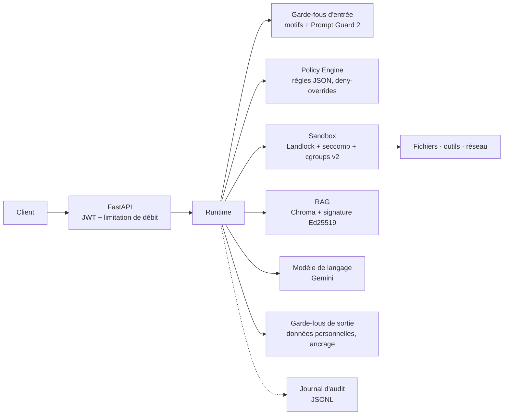

# AI Secure Runtime

Couche d'exécution sécurisée placée entre une application Web à base de LLM et les ressources qu'elle utilise (modèle de langage, fichiers, API externes, outils, base documentaire). L'application n'accède plus à rien directement : tout passe par le **Runtime**, qui demande l'avis d'un **Policy Engine** avant chaque action, puis exécute l'action autorisée dans un sous-processus confiné par le noyau Linux.

Projet réalisé dans le cadre d'un stage de fin d'études à l'ENSIAS (Rabat). C'est un prototype fonctionnel, pas un produit : les limites connues sont listées [plus bas](#limites-connues).

## Principes

- **Sécurité par construction** : le chemin vers une ressource passe nécessairement par le Runtime, on ne peut pas « oublier » un contrôle.
- **Échec fermé (fail-closed)** : ce qui n'est pas explicitement autorisé est refusé ; ce qui ne peut pas être vérifié l'est aussi.
- **Point de décision unique** : toutes les règles sont dans le Policy Engine, écrites en JSON, validées au démarrage.

## Architecture



Ordre des contrôles pour une requête `/ask` : limitation de débit → identité (JWT de type *access*) → garde-fous d'entrée → autorisation du Policy Engine (`llm` / `ask`) → appel au modèle → masquage des données personnelles dans la réponse. Pour `/ask-with-context`, la recherche documentaire s'insère avant l'appel au modèle, avec ses propres contrôles (voir ci-dessous).

## Fonctionnalités

| Composant | Rôle | Technologies |
|---|---|---|
| Application | Expose les méthodes du Runtime en HTTP | FastAPI, Uvicorn, Pydantic |
| Authentification | Jetons d'accès (30 min) et de rafraîchissement (7 jours), rôles et scopes | python-jose (HS256), bcrypt |
| Limitation de débit | 10 requêtes/min sur `/ask` et `/ask-with-context`, 20/min sur les autres routes ; clé = utilisateur, sinon IP | slowapi |
| Garde-fous d'entrée | Huit motifs d'injection, longueur maximale (4000 caractères), puis classifieur ; un refus renvoie 400 | regex, Llama Prompt Guard 2 86M (`transformers`) |
| Policy Engine | Évalue chaque action (sujet, ressource, action) contre des règles JSON ; deny-overrides ; version de la politique écrite dans chaque événement d'audit | Python pur (pas d'`eval`) |
| Tool / Network Manager | Registre d'outils explicite ; pour un appel d'API, deux vérifications : `api/call` puis `network/connect` sur le domaine et le port | `ast` (calculatrice), httpx sans redirection |
| Sandbox | Chaque opération sensible (lecture/écriture de fichier, outil, appel réseau) tourne dans un sous-processus jetable, restreint par Landlock, seccomp et un cgroup v2 (256 Mo, 32 tâches, 50 % d'un cœur, 10 s) | py-landlock, pyseccomp, cgroups v2 |
| Identity Manager | Empreinte SHA-256 de chaque outil vérifiée avant lancement | `hashlib`, `tools.json` |
| RAG | Recherche vectorielle ; intégrité (signature Ed25519 de chaque passage), contrôle d'accès par classification, examen du contenu, balisage et marquage des données (spotlighting) | Chroma, `cryptography` |
| Garde-fous de sortie | Masquage des e-mails, téléphones (MA/FR), cartes bancaires (Luhn) ; mesure d'ancrage dans les passages (journalisée, non bloquante) | regex, similarité cosinus |
| Audit | Journal structuré rotatif (10 Mo × 5), catégories distinctes : refus de politique, refus Landlock, violation seccomp, dépassement cgroup, rejet d'identité, panne d'infrastructure | structlog |

Un refus de sécurité (HTTP 403) se distingue d'une panne du mécanisme lui-même (HTTP 500) : une panne de sandbox n'est jamais présentée comme une décision de politique.

## Prérequis

- Linux avec **cgroups v2**, **Landlock** et **seccomp**. Le filtrage réseau de Landlock (ABI 4) demande un noyau ≥ 6.7. Sous WSL2, le noyau livré par défaut est trop ancien : il faut le mettre à jour ; seccomp peut y être indisponible et se dégrade alors explicitement (Landlock reste actif).
- Python 3.12 (version de l'image Docker).
- Une clé d'API Gemini : le modèle utilisé est `gemini-3.5-flash`, via `google-genai`.
- Un compte Hugging Face pour télécharger `meta-llama/Llama-Prompt-Guard-2-86M` : le modèle est soumis à licence, il faut accepter ses conditions sur Hugging Face puis se connecter (`hf auth login`) avant le premier lancement.

## Installation (mode natif)

```bash
git clone https://github.com/hibamon7/secure-runtime.git
cd secure-runtime
python3 -m venv .venv && source .venv/bin/activate

# torch CPU d'abord, comme dans le Dockerfile (évite la chaîne CUDA, > 1,5 Go)
TORCH_VERSION=$(grep -E "^torch==" requirements.txt | sed -E 's/^torch==//')
pip install "torch==${TORCH_VERSION}" --index-url https://download.pytorch.org/whl/cpu
grep -vE "^(torch==|triton==|nvidia-|cuda-)" requirements.txt > /tmp/requirements-nogpu.txt
pip install -r /tmp/requirements-nogpu.txt
```

Créer un fichier `.env` à la racine (il est ignoré par git) :

```bash
JWT_SECRET_KEY=<une longue valeur aléatoire>
GEMINI_API_KEY=<votre clé Gemini>
```

`JWT_SECRET_KEY` est obligatoire : l'application refuse de démarrer sans elle.

### Clés d'intégrité du RAG

La clé privée de signature ne vit **jamais** dans le dépôt.

```bash
python app/scripts/generate_signing_keypair.py
```

Le script affiche une paire de clés. La clé publique se place dans `app/runtime/policy_engine/rag_layer.json` ; la clé privée se conserve hors du dépôt et ne sert qu'à l'indexation :

```bash
INDEXATION_PRIVATE_KEY='<clé privée>' PYTHONPATH=. python app/scripts/index_test_documents.py
```

Ce script indexe trois documents d'exemple, signe chaque passage et réécrit `rag_classification.json`. L'index (`data/rag_index/`) n'est pas versionné ; il se reconstruit avec cette commande.

### Empreinte d'un outil

L'ajout ou la modification d'un outil impose de mettre à jour son empreinte dans `tools.json` :

```bash
python app/scripts/compute_tool-hash.py app/runtime/tool_manager/tools/calculator.py
```

Un outil dont l'empreinte ne correspond pas n'est jamais lancé.

## Lancement

**Natif.** Le Runtime crée des cgroups à la volée : le processus doit en avoir la délégation. Sous systemd :

```bash
systemd-run --user --scope -p Delegate=yes --setenv=PATH="$PATH" -- \
    uvicorn app.main:app --host 0.0.0.0 --port 8000
```

**Docker.**

```bash
docker compose up --build
```

`JWT_SECRET_KEY` est lue dans l'environnement ou dans le `.env` du dossier. Le script `docker/entrypoint.sh` prépare l'arbre de cgroups en root, puis cède la main à un utilisateur non privilégié.

> **Contrainte de prototype.** Le conteneur est lancé avec `privileged: true`, faute d'avoir trouvé mieux pour obtenir la délégation de cgroups dans notre environnement (Docker Desktop sur WSL2). C'est acceptable pour valider l'architecture, pas pour un déploiement exposé.

Une fois lancé :

- console de démonstration : <http://localhost:8000/> (exerce chaque méthode du Runtime et affiche le journal d'audit en direct) ;
- documentation OpenAPI : <http://localhost:8000/docs>.

## API

| Route | Corps | Règle du Policy Engine |
|---|---|---|
| `POST /auth/register` | `username`, `password` | rôle `user`, scope `file:read` imposés par le serveur |
| `POST /auth/login` | `username`, `password` | renvoie jetons d'accès et de rafraîchissement |
| `POST /auth/refresh` | jeton de rafraîchissement | — |
| `POST /ask` | `prompt` | `llm` / `ask` |
| `POST /ask-with-context` | `prompt` | `llm` / `ask`, `rag` / `query`, puis `rag_document` / `use` par passage classé |
| `POST /read-file` | `path` | `file` / `read`, scope `file:read`, taille ≤ 20 Mo |
| `POST /write-file` | `path`, `content` | `file` / `write`, scope `file:write` |
| `POST /execute-tool` | `name`, `expression` | `tool` / `execute` |
| `POST /call-api` | `url`, `method` | `api` / `call`, puis `network` / `connect` |
| `POST /query-rag` | `query`, `n_results` | `rag` / `query` |
| `GET /audit` | — | réservé au rôle `admin` |

Deux comptes de démonstration existent, définis dans le code (`app/auth/users_db.py`) : `alice` (`admin`, tous les scopes) et `bob` (`user`, scope `file:read`). Ils ne sont là que pour la démonstration. La base d'utilisateurs est en mémoire.

```bash
TOKEN=$(curl -s -X POST localhost:8000/auth/login \
  -H 'Content-Type: application/json' \
  -d '{"username":"alice","password":"alice_pwd"}' | python3 -c 'import sys,json; print(json.load(sys.stdin)["access_token"])')

curl -s -X POST localhost:8000/execute-tool \
  -H "Authorization: Bearer $TOKEN" -H 'Content-Type: application/json' \
  -d '{"name":"calculator","expression":"2+3*4"}'
```

## Politique

Les règles sont dans `app/runtime/policy_engine/rules.json` :

```json
{
  "id": "allow-read-user-uploads",
  "resource": "file", "action": "read",
  "path_prefix": "/data/user_uploads/", "effect": "allow",
  "conditions": {
    "role": ["user", "admin"],
    "required_scopes": ["file:read"],
    "max_file_size_mb": 20
  }
}
```

- **Aucune règle applicable → refus.** Un `deny` l'emporte sur tout `allow`.
- Les chemins sont résolus (`Path.resolve()`) puis comparés par composants : `/data/user_uploads/../../etc/passwd` et `/data/user_uploads_evil/` ne passent pas.
- Le fichier est validé au chargement : un `effect` invalide ou une clé de condition inconnue empêche le démarrage au lieu d'être ignoré.
- Toute modification non triviale se traduit par une nouvelle `version` dans `rules.json` et une entrée dans `changelog.md`.

Toutes les valeurs de sécurité (seuils, motifs, appels système interdits, limites de ressources, empreintes) sont en JSON dans le même dossier, chacune avec son numéro de version.

## Mesures sur le classifieur d'entrée

Corpus public `deepset/prompt-injections` (546 exemples), script `app/scripts/regex_vs_model.py` :

| | Précision | Rappel |
|---|---|---|
| Motifs seuls | 1,00 | 0,025 |
| Motifs + Prompt Guard 2 | 0,98 | 0,26 |

Les motifs ne bloquent presque rien sur ce corpus ; le classifieur en attrape environ un quart. Ce n'est pas une garantie : c'est une couche parmi d'autres. Le corpus est public et ancien, il peut surestimer ou sous-estimer les performances sur des attaques récentes.

## Tests

```bash
pytest tests/ -v
```

Une soixantaine de tests (Policy Engine, garde-fous, outils, Landlock, cgroups, RAG, audit, Runtime). Chaque test travaille sur un index Chroma temporaire. En mode natif, lancez-les sous le même préfixe `systemd-run` que l'application : les tests qui utilisent le vrai sandbox ont besoin de la délégation de cgroups. Ceux qui chargent Prompt Guard nécessitent le modèle téléchargé.

Un diagnostic de la délégation est fourni : `python -m app.scripts.diagnose_cgroup`.

## Journal d'audit

`logs/audit.jsonl`, un objet JSON par ligne, rotation à 10 Mo (5 fichiers). Événements principaux : `policy_decision`, `policy_denial`, `landlock_denial`, `seccomp_violation`, `cgroup_exceeded`, `identity_rejection`, `infra_failure`, `output_pii_redacted`, `output_grounding_low`, `rag_document_rejected_*`. Consultable par un administrateur via `GET /audit`.

## Structure du dépôt

```
app/
  main.py                    application FastAPI et console de démonstration
  llm.py                     appel au modèle de langage
  api/                       routes HTTP et consultation du journal
  auth/                      JWT, mots de passe, utilisateurs de démonstration
  runtime/
    main.py                  classe Runtime
    policy_engine/           moteur + fichiers JSON de configuration
    input_guardrails/        motifs + classifieur
    output_guardrails/       données personnelles + ancrage
    tool_manager/            registre, identité, outils
    sandbox_manager/         worker Landlock/seccomp, cgroups, reçu d'autorisation
    rag_layer/               recherche, intégrité, classification
    audit_manager/           journal structuré
  scripts/                   diagnostic, indexation, benchmark, empreintes
tests/                       suite pytest
docker/                      script d'entrée du conteneur
Dockerfile, docker-compose.yml
```

## Limites connues

- Le conteneur doit être **privilégié** pour que la délégation de cgroups fonctionne.
- La résolution DNS n'est pas protégée contre le rebinding ; le filtrage réseau de Landlock se fait par port, pas par domaine (le domaine est vérifié par le Network Manager).
- Une fenêtre de quelques microsecondes sépare le lancement du processus de son rattachement au cgroup ; `clone3` avec `CLONE_INTO_CGROUP` la fermerait.
- Le classifieur de prompts a un rappel limité (26 % sur le corpus de mesure) et ne lit que les 512 premiers tokens.
- Le registre de classification des documents est tenu à la main : un passage non enregistré est servi sans restriction supplémentaire.
- L'intégrité du RAG garantit qu'un passage n'a pas changé depuis son indexation, pas qu'il est à jour ; la suppression d'un passage n'est pas détectée.
- Le journal d'audit n'a pas de preuve d'intégrité.
- L'appel au modèle part du processus principal, hors du Network Manager.
- Les jetons ne sont pas révocables, les utilisateurs sont en mémoire, et le limiteur de débit est local à un processus.
- Les tests de charge, les tests d'intrusion manuels et la mesure de l'effort d'intégration n'ont pas été réalisés.

## Licence

À définir : le fichier `License` du dépôt est actuellement vide.
